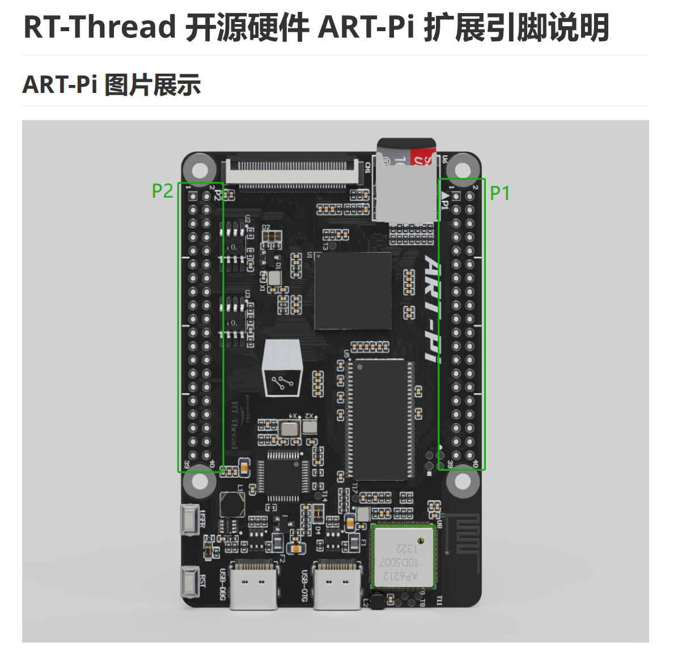
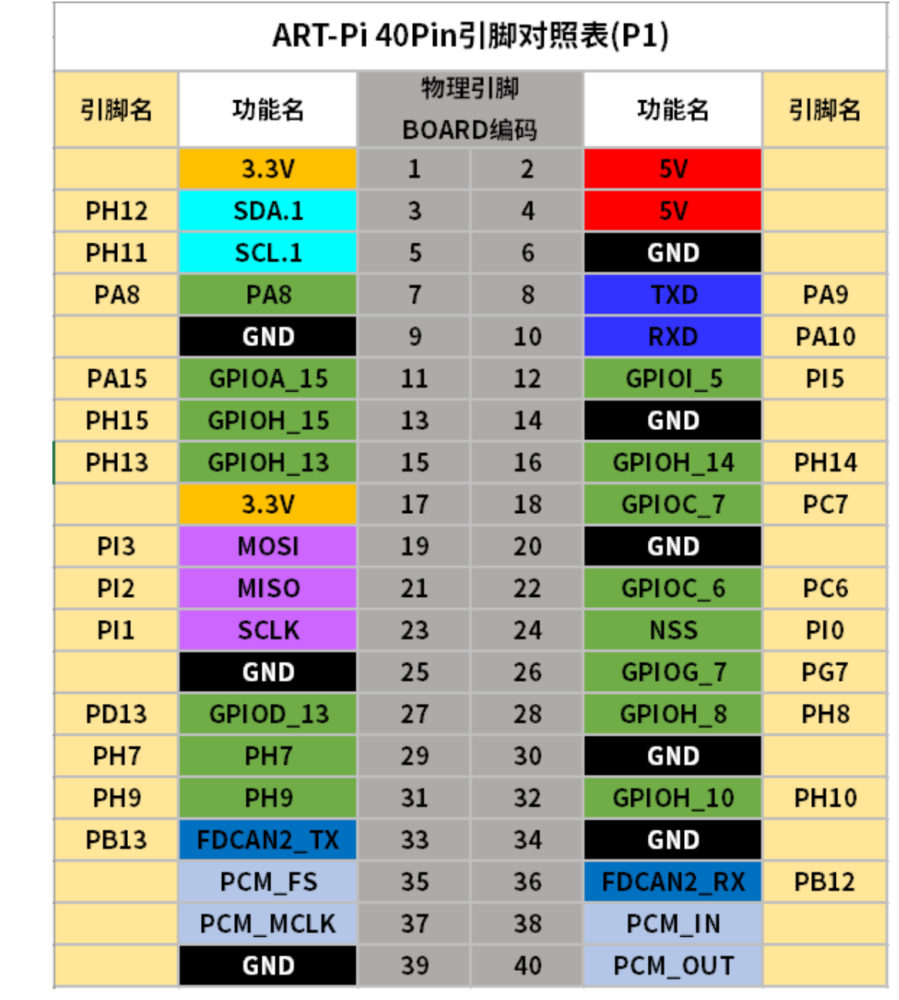
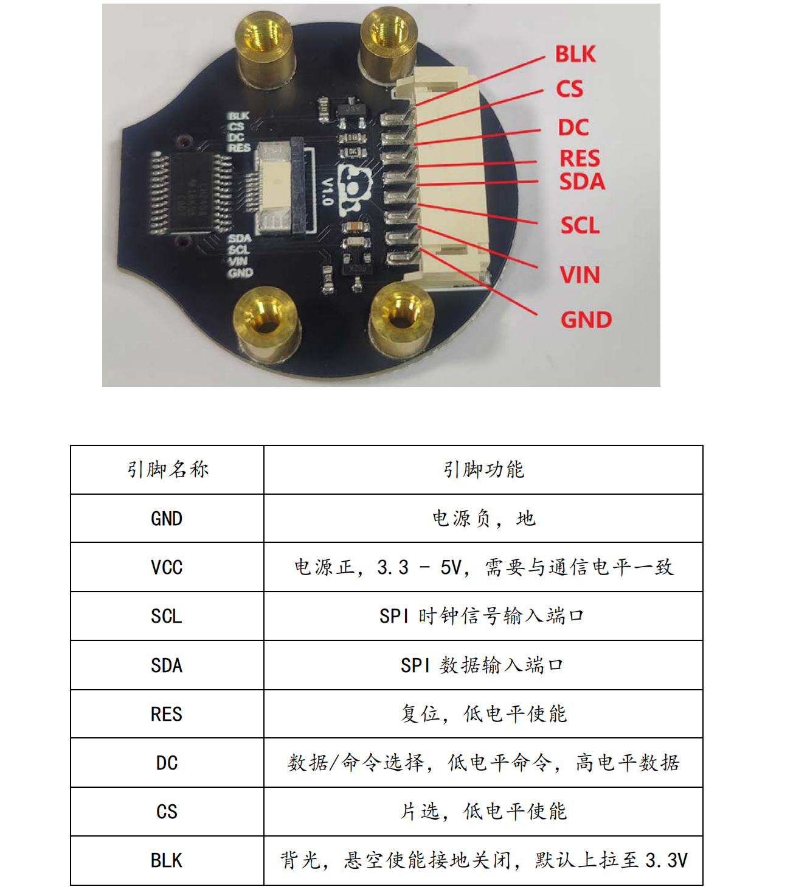
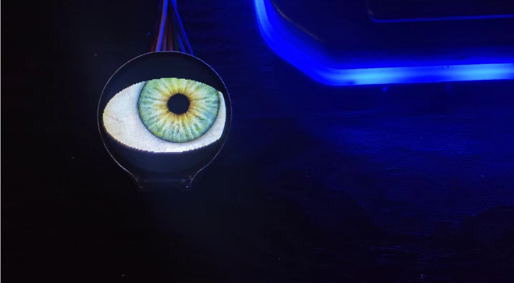

# Eye_stm32

## 1. 概述

在stm32h7上使用开源项目Uncanny_Eyes，硬件使用 rtthread 官方的开发板 ART-PI，屏幕使用1.28英寸GC9A01圆形TFT

## 2. 硬件连接

artpi：

io 连接：

* LCD_SCL_PIN（PI1）
* LCD_SDA_PIN (PI3）
* LCD_RES_PIN  (PH13)
* LCD_DC_PIN   (PH15)
* LCD_CS_PIN    (PA5)
* LCD_BLK_PIN  (PA8)

## 3. 显示效果

## 4. 相关网站

Animated官网：
https://learn.adafruit.com/animated-electronic-eyes/software

git仓库：
https://github.com/adafruit/Uncanny_Eyes

artpi官网：
https://art-pi.github.io/website/

